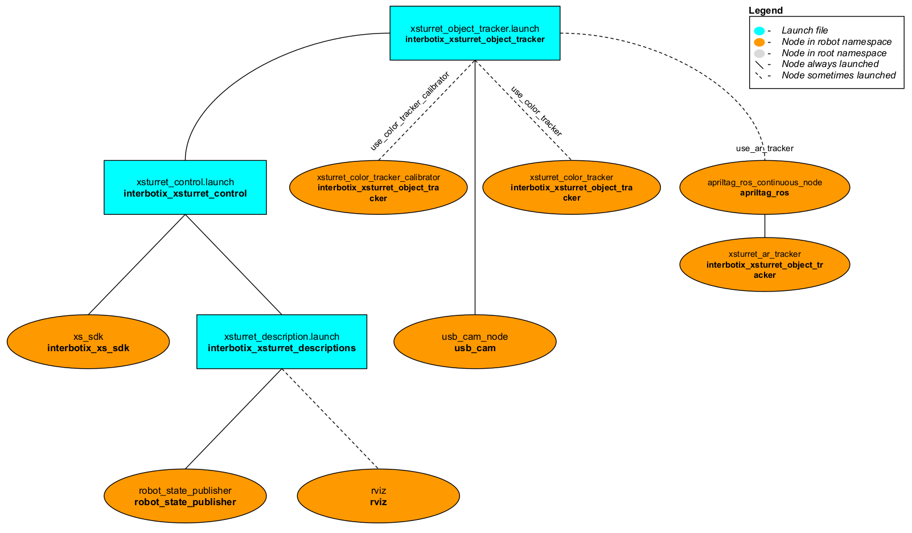
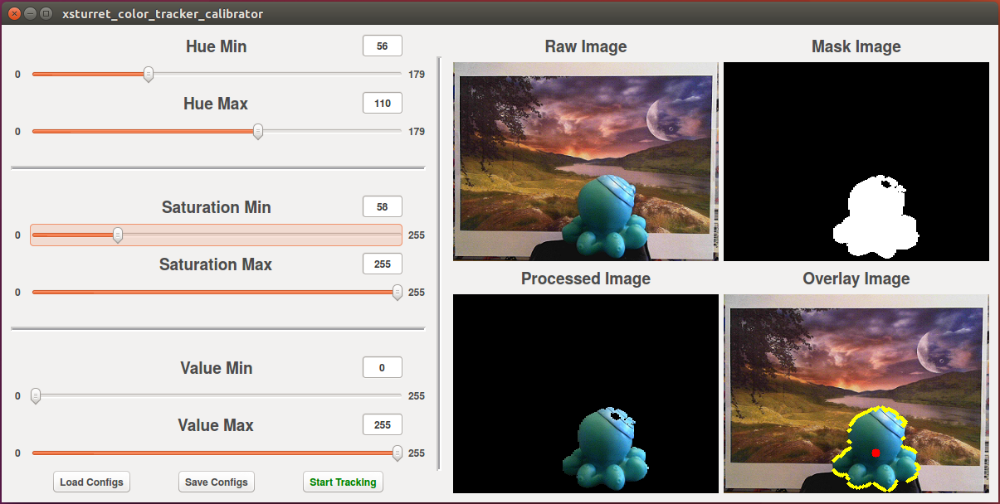
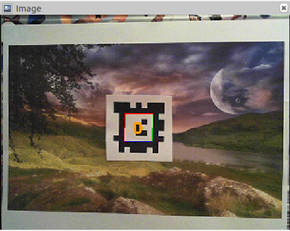

# interbotix_xsturret_object_tracker

## Overview
This package can be used to perform object tracking using the [PhantomX Vision Tracking Kit](https://www.trossenrobotics.com/phantomx-x-series-robot-vision-tracking-kit.aspx). Built using [XL430](https://emanual.robotis.com/docs/en/dxl/x/xl430-w250/) Dynamixel servos and containing the high-end [Microsoft Lifecam Studio](https://www.microsoft.com/accessories/en-ww/products/webcams/lifecam-studio/q2f-00013) 1080p camera, this system has what it takes to perform your object tracking needs. Specifically, this package highlights two distinct methods to help jump-start your projects. The first uses color segmentation to track the region of interest while the second uses AR tags.

## Structure

As shown above, the *interbotix_xsturret_object_tracker* package builds on top of the *interbotix_xsturret_control* package. To get familiar with that package, please look at its README. The nodes in this package are described below:
- **usb_cam_node:** takes images from a USB camera and publishes them to the `/$(arg robot_name)/image_raw` topic
- **xsturret_color_tracker_calibrator:** displays a GUI that provides a testing environment for the user - including the ability to tune the Hue, Saturation, and Value (HSV) upper and lower limits used in color segmentation for any desired color; it also presents image feedback to the user based on the current HSV settings and allows for the user to start or stop tracking at the press of a button.
- **xsturret_color_tracker:** loads HSV configs from a file and performs object tracking (based on color segmentation) in a headless state.
- **apriltag_ros_continuous_node:** responsible for finding an AR tag in a stream of images and publishing a transform from the camera frame -  `$(arg robot_name)/lifecam_link` to it.
- **xsturret_ar_tracker:** subscribes to the output from the **apriltag_ros** node and commands the motors to rotate to keep the AR tag centered in the image frame.

## Theory

#### Camera Setup
Although there are a few ROS packages that make it possible to stream images from USB cameras into ROS, I found the [usb_cam](http://wiki.ros.org/usb_cam) ROS package particularly easy to get setup. One important step that it requires though is camera calibration. You can get around this step either by doing nothing (in which case the package will just use the default calibration file provided [here](config/lifecam.yaml)) or by creating your own file by following [this](http://wiki.ros.org/camera_calibration/Tutorials/MonocularCalibration) tutorial. Note that the checkerboard it suggests using is quite big, but your printer should be smart enough to figure out how to shrink it to fit on a regular sized piece of paper. Just make sure to measure the square size with a ruler before continuing with the calibration.

If you are calibrating the camera, type the following in the terminal to start the camera node with the parameters that will be used during the actual tracking demos.

        roslaunch interbotix_xsturret_object_tracker camera_calibration.launch

Afterwards, start the calibration node by copying the code outlined in the tutorial linked above and pasting it into a terminal. Finally, save the generated YAML file in the [config](config/) directory as 'lifecam.yaml'.

As an FYI, there are different types of cameras in the world - some of them seemingly requiring more rectification than others. For example, pinhole cameras tend to output somewhat distorted images where real life straight lines appear slightly curved. To get around this, a ROS package called [image_proc](http://wiki.ros.org/image_proc) uses the YAML file outputted from the camera_calibration node to rectify the image so that this distortion is removed. However, it seems that the LifeCam camera used in this project does rectification internally as the images outputted on the `/image_raw` topic looks distortion free. As a result, I decided not to include the image_proc package in this package's pipeline. Finally, in the interest of reducing the amount of processing the computer has to do for each image, the camera resolution was lowered to 320x240.

#### Color Segmentation
A good article that explains the basics of performing color segmentation using OpenCV can be found [here](https://www.learnopencv.com/invisibility-cloak-using-color-detection-and-segmentation-with-opencv/). The method used in this package is very similar to that approach in that it uses OpenCV's tools as well, but it's a bit simpler. The core steps are:
1. Convert the image from [Sensor_msgs/Image](http://docs.ros.org/melodic/api/sensor_msgs/html/msg/Image.html) to an OpenCV compatible format using [cv_bridge](http://wiki.ros.org/cv_bridge).
2. Convert the image color-space from BGR (Blue, Green, Red) to HSV (Hue, Saturation, Value) as it's more conducive to color segmentation.
3. Apply a 'mask' to the raw image by 'blacking out' any pixel that contains an HSV combination above or below predefined upper and lower limits respectively. All other pixels are displayed white.
4. Perform some [morphological operations](https://opencv-python-tutroals.readthedocs.io/en/latest/py_tutorials/py_imgproc/py_morphological_ops/py_morphological_ops.html) to 'clean up' the masked image from noise (false positives). In the **xsturret_color_tracker** nodes, the 'opening' operation is done followed by 'dilation' using a 5x5 elliptical kernel.
5. Use OpenCV's [findContours](https://opencv-python-tutroals.readthedocs.io/en/latest/py_tutorials/py_imgproc/py_contours/py_contours_begin/py_contours_begin.html) function to find the pixels that form a boundary around the 'white pixel group' followed by the [minEnclosingCircle](https://docs.opencv.org/2.4/modules/imgproc/doc/structural_analysis_and_shape_descriptors.html?highlight=minenclosingcircle#minenclosingcircle) function to get the approximate center of the group.
6. Calculate the offset of the group's center from the image center, and rotate the pan/tilt motors accordingly to reduce the offset.

 Note that the GUI mentioned above only allows the user to change the HSV limits - not the morphological operations or kernel size. A snapshot of the GUI doing color segmentation on a light blue octopus can be seen below.

An explanation for each part of the GUI is described below:
- **Sliders:** Can be used to adjust the minimum and maximum thresholds for the Hue, Saturation, and Value parameters. As they are moved, the images on the right-hand-side are automatically updated to reflect the changes.
- **Textboxes:** Can be used to type a specific minimum or maximum threshold for the Hue, Saturation, or Value parameters. As they are updated, the images on the right-hand-side are automatically updated to reflect the changes.
- **Load Configs:** Can be used to load a CSV file containing preset HSV parameters to the GUI. The Sliders, Textboxes, and images will be automatically updated based on those parameters.
- **Save Configs:** Can be used to save the currently displayed HSV parameters to a CSV file.
- **Start/Stop Tracking:** Can be used to start or stop the motors from doing object tracking.
- **Raw Image:** The raw 320x240 image straight from the **usb_cam_node**.
- **Mask Image:** A binary image that results after applying thresholding based on the HSV Min/Max values on the left-hand-side. The black part of the image signifies pixels outside the desired HSV range while the white part signifies pixels within the desired HSV range.
- **Processed Image:** The image that results after replacing all the 'white' pixels in the **Mask Image** with their corresponding pixels in the **Raw Image**.
- **Overlay Image:** The raw image overlaid with 'yellow' points and a 'red' circle signifying the contour and it's approximate center respectively found by OpenCV.

#### AR Tag Tracking
There are quite a few ROS packages that offer AR Tag tracking solutions. However, many of them are either not available in recent ROS Distros (Kinetic and onwards) or are not actively maintained. To that effect, it was decided to use the [apriltag_ros](http://wiki.ros.org/apriltag_ros) ROS package, which besides for being actively maintained, has been recently upgraded to use the [AprilTag3](https://github.com/AprilRobotics/apriltag) library and has minimal dependencies. It also contains many AR tag families, each with hundreds of unique AR tags which can be found at their [apriltag-imgs](https://github.com/AprilRobotics/apriltag-imgs) repository.

To get started, choose the family you'd like to use (they recommend [tagStandard41h12](https://github.com/AprilRobotics/apriltag-imgs/tree/master/tagStandard41h12)), pick a tag (such as the [first one](https://github.com/AprilRobotics/apriltag-imgs/blob/master/tagStandard41h12/tag41_12_00000.png)), and download it - just make sure to note the number in the file name as it represents the tag ID. Next, insert it into your favorite text editor, and scale it to meet your needs. Note that the tag will still look blurry. Finally, export the file as a PDF. After opening the PDF, you will see that the tag is no longer blurry, at which point you can print it out on a regular piece of paper. If you'd like, you can cut out the tag - just make sure to keep a white border around the tag that is at least the thickness of one of the small squares within the tag.

Finally, when running the `xsturret_ar_tracker` node, you should be able to subscribe to an image topic in Rviz that shows where the camera thinks the tag is. An example of this can be seen below. Note that the orange number inside the tag represents the tag ID.

  

## Usage
To run the color tracker calibrator node, type the following in a terminal:

        roslaunch interbotix_xsturret_object_tracker xsturret_object_tracker.launch use_color_tracker_calibrator:=true

To run the color tracker node (no GUI), type the following in a terminal (only do this after generating your desired HSV config file using the above calibrator tool):

        roslaunch interbotix_xsturret_object_tracker xsturret_object_tracker.launch use_color_tracker:=true

Finally, to run the AR tag tracker, type the following in a terminal (assuming you're using a tag with ID: 0 from the 'tagStandard41h12' family and a side length of 0.0508 meters - like [this](config/tag.pdf) one):

        roslaunch interbotix_xsturret_object_tracker xsturret_object_tracker.launch use_ar_tracker:=true tag_family:=tagStandard41h12 tag_id:=0 tag_size:=0.0508 tag_name:=ar_tag

 To further customize the launch file at run-time, look at the table below:

| Argument | Description | Default Value |
| -------- | ----------- | :-----------: |
| robot_model | model type of the Interbotix Turret that positions the camera (currently, only one option exists) | "pxxls_cam" |
| robot_name | name of the robot (typically equal to `robot_model`, but could be anything) | "$(arg robot_model)" |
| base_link_frame | name of the 'root' link on the turret; typically 'base_link', but can be changed if attaching the turret to a mobile base that already has a 'base_link' frame| 'base_link' |
| use_world_frame | set this to true if you would like to load a 'world' frame to the 'robot_description' parameter which is located exactly at the 'base_link' frame of the robot; if using multiple robots or if you would like to attach the 'base_link' frame of the robot to a different frame, set this to false | true |  
| external_urdf_loc | the file path to the custom urdf.xacro file that you would like to include in the Interbotix robot's urdf.xacro file| "" |
| use_rviz | launches Rviz | true |
| mode_configs | the file path to the 'mode config' YAML file | refer to [xsturret_object_tracker.launch](launch/xsturret_object_tracker.launch) |
| launch_driver | true if the *xsturret_control.launch* file should be launched - set to false if you would like to run your own version of this file separately | true |
| use_ar_tracker | launch the **xsturret_ar_tracker** node | false |
| tag_id | ID number of the tag | 0 |
| tag_size | side length of the tag in meters | 0.0508 |
| tag_name | name of the tag frame (totally arbitrary) | ar_tag |
| tag_family | name of the tag family as defined [here](https://github.com/AprilRobotics/apriltag-imgs) | tagStandard41h12 |
| standalone_tags | puts the tag_id, tag_size, and tag_name arguments into an array; this should not actually be used as an argument - it's merely a way to organize the above three arguments in the format expected by *apriltag_ros* | refer to the [launch file](launch/xsturret_object_tracker.launch) |
| use_color_tracker_calibrator | runs the **xsturret_color_tracker_calibrator** node | false |
| use_color_tracker | runs the **xsturret_color_tracker** node | false |
| hsv_configs | path to the HSV config file | refer to the [launch file](launch/xsturret_object_tracker.launch) |
| publish_contour_detections_image | set to true if the **xsturret_color_tracker** node should publish the equivalent of the **Overlay Images** discussed above to the `/$(arg robot_name)/contour_detections` topic | true |

## Citations

The [apriltag_ros](http://wiki.ros.org/apriltag_ros) package is the result of work done by:

        @mastersthesis{malyuta:2017mt,
          author = {Danylo Malyuta},
          title = {{Guidance, Navigation, Control and Mission Logic for Quadrotor Full-cycle Autonomy}},
          language = {english},
          type = {Master thesis},
          school = {Jet Propulsion Laboratory},
          address = {4800 Oak Grove Drive, Pasadena, CA 91109, USA},
          month = dec,
          year = {2017}
        }
        @inproceedings{Wang2016,
          author = {Wang, John and Olson, Edwin},
          booktitle = {2016 IEEE/RSJ International Conference on Intelligent Robots and Systems (IROS)},
          doi = {10.1109/IROS.2016.7759617},
          isbn = {978-1-5090-3762-9},
          month = {oct},
          pages = {4193--4198},
          publisher = {IEEE},
          title = {{AprilTag 2: Efficient and robust fiducial detection}},
          year = {2016}
        }
