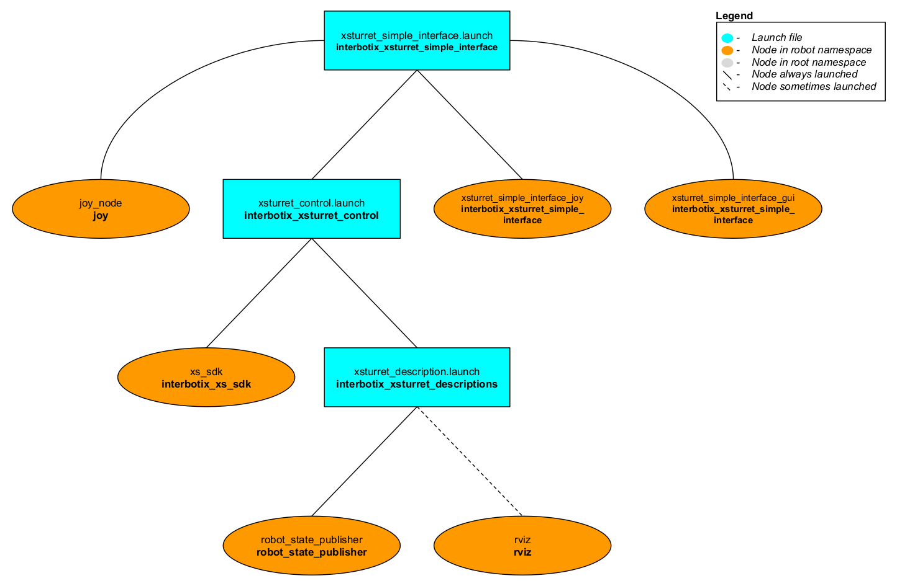
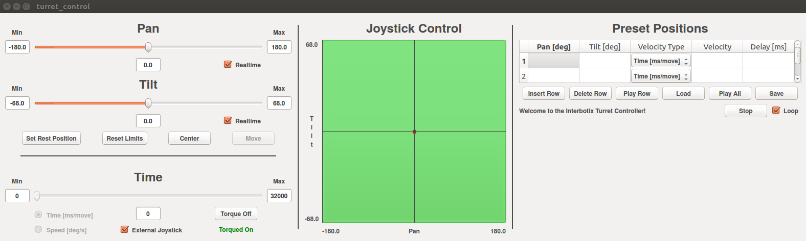

# interbotix_xsturret_simple_interface

## Overview
This package can be used to control any [X-series Turret](https://www.trossenrobotics.com/c/robot-turrets.aspx) platform in one of two ways. Either the turrets can be manipulated using a SONY PS3/PS4 controller via Bluetooth or the same can be done with a GUI. The target audience for this package are users who prefer to operate the turrets without having to directly program them.

## Structure

As shown above, the *interbotix_xsturret_simple_interface* package builds on top of the *interbotix_xsturret_control* package. To get familiar with that package, please look at its README. The nodes in this package are described below:
- **joy** - a ROS driver for a generic Linux joystick; it reads data from a SONY PS3 or PS4 controller joystick over Bluetooth and publishes  [sensor_msgs/Joy](http://docs.ros.org/melodic/api/sensor_msgs/html/msg/Joy.html) messages to the `commands/joy_raw` topic
- **xsturret_simple_interface_joy** - responsible for reading in raw [sensor_msgs/Joy](http://docs.ros.org/melodic/api/sensor_msgs/html/msg/Joy.html) messages from the `commands/joy_raw` topic and converting them into [interbotix_xs_msgs/TurretJoy](https://github.com/Interbotix/interbotix_ros_core/tree/main/interbotix_ros_xseries/interbotix_xs_msgs/msg/TurretJoy.msg) messages; this makes the code more readable and allows users to remap buttons very easily later. These messages are then published to `commands/joy_processed`.
- **xsturret_simple_interface_gui** - responsible for reading in [interbotix_xs_msgs/TurretJoy](https://github.com/Interbotix/interbotix_ros_core/tree/main/interbotix_ros_xseries/interbotix_xs_msgs/msg/TurretJoy.msg) messages from the `commands/joy_processed` topic and sending 'pan' and 'tilt' commands to the *xs_sdk*; besides for allowing external joystick control, it also displays a GUI to the user that can be used to manipulate the turret.

## Bluetooth Setup
#### Sony PS4 Controller (Recommended)
Getting a PS4 controller connected via Bluetooth to a Linux laptop is pretty straightforward. Click the *Bluetooth* icon on the top right of your screen, followed by *Bluetooth Settings...*. Next, press and hold the *Share* button on the PS4 controller (see image below for reference). While holding the *Share* button, press and hold the *PS* button. After a few seconds, the triangular shaped LED located between the *L2* and *R2* buttons should start rapidly flashing white (about twice a second) at which point you can let go.

On the computer, click the '+' icon in the *Bluetooth* settings window. Wait until you see 'Wireless Controller' pop up, select it, and click *Next* on the bottom right of the window. A message should display saying 'successfully set up new device 'Wireless Controller'' and the LED should turn blue. This means the controller is connected to the computer. To disconnect, hold down the *PS* button for about 10 seconds until the LED turns off. To reconnect, just press the *PS* button (no need to hold it down). After blinking white a few times, the LED should turn blue.


#### Sony PS3 Controller
Getting a PS3 controller connected via Bluetooth to a Linux laptop can be a bit finicky at times. However, the commands below should do the trick. Get an original SONY PS3 controller, it's accompanying USB cable, and open up a terminal. Type:
```
$ sudo bluetoothctl
[bluetooth]# power on
[bluetooth]# agent on
[bluetooth]# scan on
```
Now, plug the PS3 controller into the Linux Laptop. At this point, a message should pop up in the terminal that looks something like the following (with a different MAC address):
```
[NEW] Device FC:62:B9:3F:79:E7 PLAYSTATION(R)3 Controller
```
When it appears, type:
```
[bluetooth]# trust <MAC-address>
```
Now unplug the PS3 controller and press the PS button. The four red LEDs at the front of the controller should flash a few times, eventually leaving just one LED on by the '1'. This means that the joystick paired successfully.

Sometimes, the joystick might cause the cursor of the computer mouse to go crazy. To fix this, add the following line to the `.bashrc` file:
```
alias joy_stop='xinput set-prop "PLAYSTATION(R)3 Controller" "Device Enabled" 0'
```
Now whenver the PS3 joystick is paired to the computer, just type `joy_stop` in the terminal to stop it messing with the mouse (you're welcome).

## Usage
After pairing the joystick, type the following in a terminal (let's say to control the ViperX Dual XM540 Turret with a PS4 controller):
```
roslaunch interbotix_xsturret_simple_interface xsturret_simple_interface.launch robot_model:=vxxmd
```
A red error message might appear in the screen saying `Couldn't open joystick force feedback!`. This is normal and will not affect the joystick operation. To further customize the launch file at run-time, look at the table below:

| Argument | Description | Default Value |
| -------- | ----------- | :-----------: |
| robot_model | model type of the Interbotix Turret such as 'wxxms' or 'vxxmd' | "" |
| robot_name | name of the robot (typically equal to `robot_model`, but could be anything) | "$(arg robot_model)" |
| base_link_frame | name of the 'root' link on the turret; typically 'base_link', but can be changed if attaching the turret to a mobile base that already has a 'base_link' frame| 'base_link' |
| use_world_frame | set this to true if you would like to load a 'world' frame to the 'robot_description' parameter which is located exactly at the 'base_link' frame of the robot; if using multiple robots or if you would like to attach the 'base_link' frame of the robot to a different frame, set this to false | true |  
| external_urdf_loc | the file path to the custom urdf.xacro file that you would like to include in the Interbotix robot's urdf.xacro file| "" |
| use_rviz | launches Rviz | true |
| mode_configs | the file path to the 'mode config' YAML file | refer to [xsturret_simple_interface.launch](launch/xsturret_simple_interface.launch) |
| threshold | value from 0 to 1 defining joystick sensitivity; a larger number means the joystick should be less sensitive | 0.75 |
| controller | type of Playstation controller ('ps3' or 'ps4') | ps4 |
| launch_driver | 'true' if the *xsturret_control.launch* file should be launched - set to 'false' if you would like to run your own version of this file separately | true |
| use_sim | if true, the Dynamixel simulator node is run; use Rviz to visualize the robot's motion; if false, the real Dynamixel driver node is run | false |

After launching, a GUI should pop up similar to the one below. To become more familiar with the GUI and external joystick controls, please refer to the tutorial located [here](Turret_Control_Tutorial.pdf).



If only controlling the turret with a joystick, look at the diagram and table below (make sure that the 'External Joystick' check-box is checked in the GUI or your controller will not do anything):

#### PS3 & PS4 Button Mapping


| Button | Action |
| ------ | ------ |
| START/OPTIONS | move the turret to its center position |
| R2 | rotate the 'pan' joint clockwise |
| L2 | rotate the 'pan' joint counterclockwise |
| D-pad Up | increase motor angular velocity in steps |
| D-pad Down | decrease motor angular velocity in steps|
| D-pad Left | 'Coarse' control - sets motor angular velocity to a user-preset 'fast' speed |
| D-pad Right | 'Fine' control - set motor angular velocity to a user-preset 'slow' speed |
| Right stick Left/Right | pan the Turret CCW/CW |
| R3 | reverses the Right stick Left/Right control and R2/L2 buttons |
| Left stick Up/Down | tilt the Turret forward/backward |
| L3 | reverses the Left stick Up/Down control|
