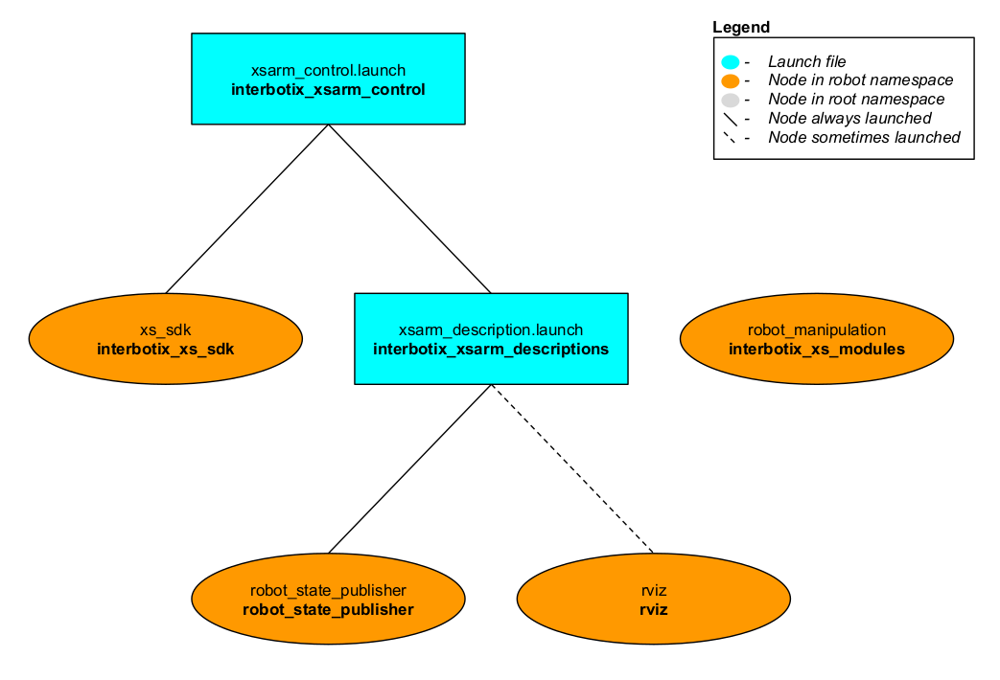

# Turret Python API Demos

## Overview
This directory showcases various ways of using the [Interbotix Python Turret Module](https://github.com/Interbotix/interbotix_ros_toolboxes/blob/main/interbotix_xs_toolbox/interbotix_xs_modules/src/interbotix_xs_modules/turret.py) (click the link to see the fully documented code; also check out the [interbotix_xs_modules](https://github.com/Interbotix/interbotix_ros_toolboxes/tree/main/interbotix_xs_toolbox/interbotix_xs_modules) package to get a better understanding on how this and other modules can be used). Simply put, this API was created so that users with little to no ROS experience would still have the ability to control any Interbotix Turret supported by the *interbotix_xs_sdk*. The API is best suited for scripting motions at desired times, speeds, and more!

## Structure


The Python Arm module (located in the *interbotix_xs_modules* ROS package) builds on top of the *interbotix_xs_sdk* package. To get familiar with the other nodes in the graph above, look at the various packages READMEs.
- **robot_manipulation** - a ROS node (operating 'behind the scenes') that takes in commands entered via the Python API and publishes data to various ROS topics as necessary. It is not a classic ROS node in the sense that it can't be launched from a ROS launch file or run from the terminal using a `rosrun` command. Rather, the Python API module contains a Class that when instantiated, gives the node life. At the completion of a program, the object gets destroyed, killing the node.

## Usage
To get started, open up a terminal and type (assuming a PhantomX XL430 is being launched)...
```
roslaunch interbotix_xsturret_control xsturret_control.launch robot_model:=pxxls
```

Note, that if you want to test out your code first on a [simulated](https://github.com/Interbotix/interbotix_ros_core/tree/main/interbotix_ros_xseries/interbotix_xs_sdk#overview) turret (best with 'Time-Based Profile' motion only), you can type...

```
roslaunch interbotix_xsturret_control xsturret_control.launch robot_model:=pxxls use_sim:=true
```

In another terminal, navigate to this directory and type...
```
python turret_time_profile_control.py        # python3 turret_time_profile_control.py if using ROS Noetic
```
You should observe the robot navigate through a series of motions - sometimes moving both joints and sometimes just moving one. The other scripts work in a similar fashion. To make things easier, they are also documented to give you a better understanding of how the code works.
