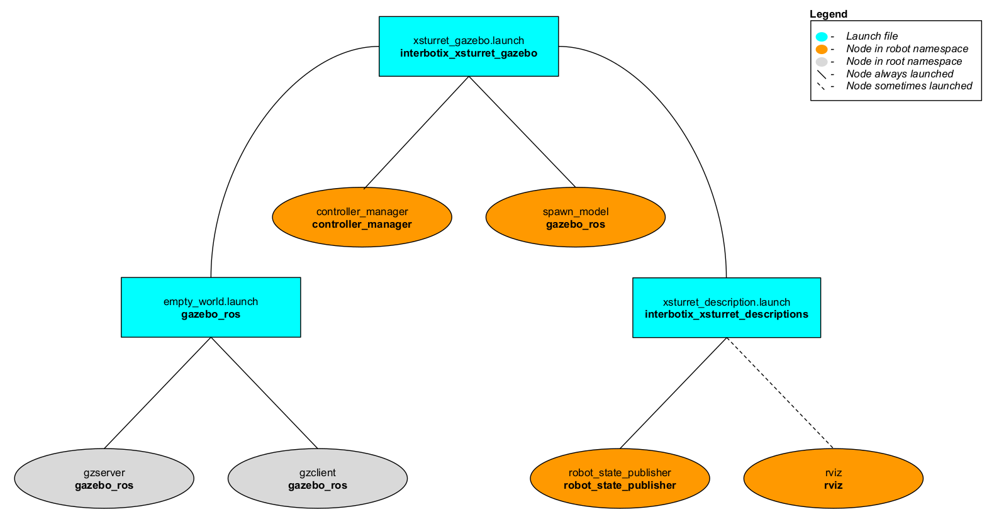

# interbotix_xsturret_gazebo

## Overview
This package contains the necessary config files to get any of the many Interbotix X-Series turrets working in Gazebo. Specifically, it contains the [interbotix_texture.gazebo](config/interbotix_texture.gazebo) file which allows the black texture of the robotic turrets to display properly (following the method explained [here](http://answers.gazebosim.org/question/16280/how-to-use-custom-textures-on-urdf-models-in-gazebo/)). It also contains YAML files with tuned PID gains for the pan/tilt joints so that ros_control can control them effectively. This package is meant to be used in conjunction with a node that publishes joint positions to the appropriate topics.

## Structure

As shown above, the *interbotix_xsturret_gazebo* package builds on top of the *interbotix_xsturret_descriptions* and *gazebo_ros* packages. To get familiar with the nodes in the *interbotix_xsturret_descriptions* package, please look at its README. The other nodes are described below:
- **gzserver** - responsible for running the physics update-loop and sensor data generation
- **gzclient** - provides a nice GUI to visualize the robot simulation
- **controller_manager** - responsible for loading and starting a set of controllers at once, as well as automatically stopping and unloading those same controllers
- **spawn_model** - adds the robot model as defined in the 'robot_description' parameter into the Gazebo world

## Usage
To run this package, type the line below in a terminal (assuming the WidowX XM430 turret is being launched).
```
$ roslaunch interbotix_xsturret_gazebo xsturret_gazebo.launch robot_model:=wxxms
```
Since by default, Gazebo is started in a 'paused' state (this is done to give time for the controllers to kick in), unpause the physics once it is fully loaded by typing:
```
$ rosservice call /gazebo/unpause_physics
```
This is the bare minimum needed to get up and running. Take a look at the table below to see how to further customize with other launch file arguments.

| Argument | Description | Default Value |
| -------- | ----------- | :-----------: |
| robot_model | model type of the Interbotix Turret such as 'wxxms' or 'vxxmd' | "" |
| robot_name | name of the robot (typically equal to `robot_model`, but could be anything) | "$(arg robot_model)" |
| base_link_frame | name of the 'root' link on the turret; typically 'base_link', but can be changed if attaching the turret to a mobile base that already has a 'base_link' frame| 'base_link' |
| use_world_frame | set this to true if you would like to load a 'world' frame to the 'robot_description' parameter which is located exactly at the 'base_link' frame of the robot; if using multiple robots or if you would like to attach the 'base_link' frame of the robot to a different frame, set this to false | true |  
| external_urdf_loc | the file path to the custom urdf.xacro file that you would like to include in the Interbotix robot's urdf.xacro file| "" |
| use_rviz | launches Rviz | true |
| world_name | the file path to the Gazebo 'world' file to load | refer to [xsturret_gazebo.launch](launch/xsturret_gazebo.launch) |
| gui | launch the Gazebo GUI | true |
| debug | Start gzserver in debug mode using gdb | false |
| paused | start Gazebo in a paused state | true |
| recording | enable Gazebo state log recording | false |
| use_sim_time | tells ROS nodes asking for time to get the Gazebo-published simulation time, published over the ROS topic /clock | true |
| use_position_controllers | set to true to have the ability to command arbitrary positions to the turret joints in Gazebo | true |
